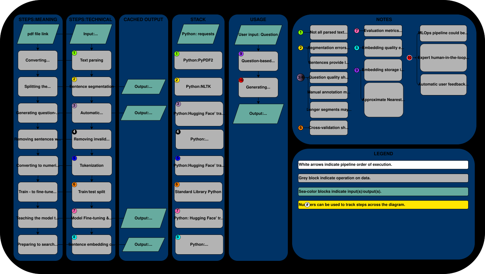

# Chatbot for Construction Legislation (EU DIRECTIVE 2018/1972)

This repository contains the code, data, and pipeline documentation for a chatbot project. The chatbot's primary task is to answer user questions about construction legislation based on the text of (EU) DIRECTIVE 2018/1972.

## Demo Workflow

The demo includes the following steps:

### 1. Data Preparation
- **Ingestion**: Parsing the data from a PDF file.
- **Cleaning**: Removing special characters.
- **Tokenization**: Splitting the text into paragraphs.

### 2. Automatic Data Annotation
- Generating question-answer pairs for each paragraph.

### 3. LLM Fine-Tuning
- Fine-tuning a large language model (LLM) using the annotated data.

### 4. Proof-of-Concept Chatbot Interface
- Building a chatbot interface using HuggingFace's Gradio library.

## Pipeline Summary

The pipeline is summarized in the following diagram:



## Repository Structure

- **[Demo.ipynb](Demo.ipynb)**: Contains the demo code for running the chatbot pipeline.
- **[chatbot_huggingface_env.yaml](chatbot_huggingface_env.yaml)**: Defines the Conda environment for the project.
- **`datasets/`**: Directory containing pre-processed directive text:
  - **`directive_dataset.json`**: Cached pre-processed dataset.
  - **`directive_subset_400.json`**: Dataset with paragraphs of approximately 400 words.
  - **`directive_subset_50.json`**: Dataset with paragraphs of approximately 50 words.

## Getting Started

### Prerequisites
- Install Conda: [Conda Installation Guide](https://docs.conda.io/projects/conda/en/latest/user-guide/install/index.html)
- Create the environment using the provided YAML file:
  ```bash
  conda env create -f chatbot_huggingface_env.yaml
  conda activate chatbot_env
  ```

### Running the Demo
1. Open `Demo.ipynb` in Jupyter Notebook or JupyterLab.
2. Follow the steps in the notebook to execute the pipeline.
